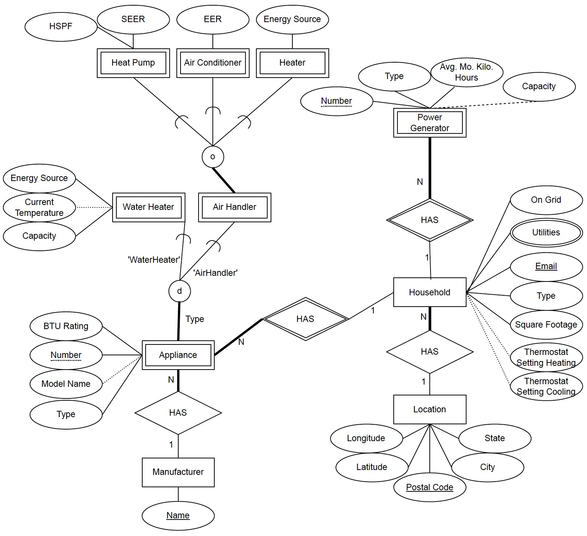

# EcoPulse
A collaborative initiative dedicated to gathering comprehensive household data worldwide. We focus on alternative power sources, properties, and sustainable energy solutions. With an open and transparent approach, anyone can contribute their data, while accessing curated reports

## Overview

The purpose of this project is to analyze, specify, design, implement, document, and demonstrate an application. 

The project follows the three phases outlined in the Database Application Development Methodology:
Analysis & Specification, Design, and Implementation. The implementation uses a fully relational, distinct Database
Management System (DBMS) that utilizes tables and supports standard SQL queries. An ORM is purposefully not used.

## Design

### Phase 1: Analysis & Specification

Starting with user specifications, we create an information flow diagram, create entity relationship diagram, and begin with abstract code.

[Phase 1 Documentation](design/Phase_1/team021_p1_report.pdf)

#### Entity Relationship Diagram (preview)
<details>
  <summary>Show Preview</summary>
  
  
</details>

### Phase 2: Design

Refine abstract code and write all required SQL queries.

[Phase 2 Documentation](design/Phase_2/team021_p2_ac+SQL.pdf)

### Phase 3: Implementation

Use selected architecture to implement the application.


## Architecture

- **React** - Frontend (src/frontend)

- **Flask** - Backend (src/app.py)

- **Postgres** - Database (src/db)

## Prerequisites

Before running the project, ensure that you have the following prerequisites installed:

- Python 3.10.0
- pyenv (recommended)
- SQLTools (vscode plugin)
- .env file with database credentials
- pgAdmin4 (recommended)
- Node.js (v19.7.0 recommended)


## Getting Started

To get started with the project, follow these steps:

1. Clone the repository:
   ```bash
   git clone https://github.com/your-username/react-flask-project.git
   ```
2. Install the backend dependencies from src/ (recommended: use pyenv)
   ```bash
   pip install -r requirements.txt
   ```
3. Install the frontend dependencies from src/frontend:
   ```bash
      npm install
   ```
   
## Running the Project
1. Start the backend server from src/:
   ```bash
   flask run --debug
   ```
2. Start the frontend server from src/frontend:
   ```bash
    npm start
    ```
   
### Contributors
| Name               |         Email          |  Username   |
| ------------------ | :--------------------: | :---------: |
| Salvador Mireles   |  smireles3@gatech.edu  |  smireles3  |
| Austin R O'Boyle   |  aoboyle3@gatech.edu   |  aoboyle3   |
| Arich J Fuher      |   afuher3@gatech.edu   |   afuher3   |
| Michael R Brinkman | mbrinkman8@gatech.edu  | mbrinkman8  |
| Charles C McDonald | cmcdonald79@gatech.edu | cmcdonald79 |
