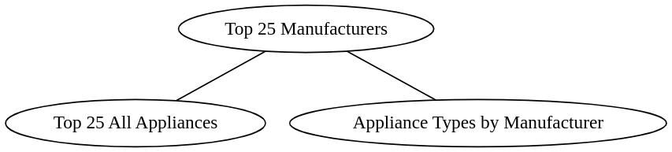

**Phase 1 Report** | CS 6400 - Spring 2023 | **Team 021**

# Table of Contents

**Alternakraft Data Types**
    [Data Types](#data-types) 
    
  
**Alternakraft Constraints** 
    [Business Logic Constraints](#business-logic-constraints) 

 
**Task Decomposition with Abstract Code:**
  - [Main Menu](#main-menu)
  - [Enter My Household Info](#enter-my-household-info)
  - [Basic Household Info](#basic-household-info)
  - [Appliance - Add](#appliance---add)
  - [Appliance - List](#appliance---list)
  - [Appliance - Delete](#appliance---delete)
  - [Power Generator - Add](#power-generator---add)
  - [Power Generator - List](#power-generator---list)
  - [Power Generator - Delete](#power-generator---delete)
  - [Thank User](#thank-user)
  - [View Reports](#view-reports)
  - [Top 25 Popular Manufacturer](#top-25-popular-manufacturers)
  - [Manufacturer/Model Search](#manufacturermodel-search)
  - [Heating/Cooling Method Details](#heatingcooling-method-details)
  - [Water Heater Statistics By State](#water-heater-statistics-by-state)
  - [Off-the-grid Household Dashboard](#off-the-grid-household-dashboard)
  - [Household averages by radius](#household-averages-by-radius)

# Data Types:   
 
**Household** 
| Attribute                  | Data Type | Nullable |
|----------------------------|-----------|----------|
| Email                      | String    | Not Null |
| Type                       | String    | Not Null |
| Square Footage             | Integer   | Not Null |
| Thermostat Setting Heating | Integer   | Null     |
| Thermostat Setting Cooling | Integer   | Null     |

**On-Grid Household**
| Attribute                  | Data Type     | Nullable |
|----------------------------|---------------|----------|
| Utilities                  | List \<String\> | Not Null |

**Off-Grid Household**
| Attribute                  | Data Type | Nullable |
|----------------------------|-----------|----------|

**Appliances**
| Attribute     | Data Type | Nullable |
|---------------|-----------|----------|
| Order Entered | Integer   | Not Null |
| BTU Rating    | Integer    | Not Null |
| Model Name    | String    | Null |
| Type          | String    | Not Null |

**Water heater**
| Attribute           | Data Type | Nullable |
|---------------------|-----------|----------|
| Energy Source       | String    | Not Null |
| Current Temperature | Integer   | Null     |
| Capacity            | Double    | Not Null |

**Heating/Cooling Method**
| Attribute     | Data Type | Nullable |
|---------------|-----------|----------|
| Order Entered | Integer   | Not Null |
| Method        | String    | Not Null |

**Heat Pump**
| Attribute | Data Type | Nullable |
|-----------|-----------|----------|
| HSPF      | Double    | Not Null |
| SEER      | Double    | Not Null |

**Air Conditioner**
| Attribute | Data Type | Nullable |
|-----------|-----------|----------|
| EER       | Double    | Not Null |

**Heater**
| Attribute     | Data Type | Nullable |
|---------------|-----------|----------|
| Energy Source | String    | Not Null |

**Manufacturer**
| Attribute    | Data Type | Nullable |
|--------------|-----------|----------|
| Name         | String    | Not Null |

**Power Generation**
| Attribute            | Data Type | Nullable |
|----------------------|-----------|----------|
| Order Entered        | Integer   | Not Null |
| Type                 | String    | Not Null |
| Avg. Mo. Kilo. Hours | Integer   | Not Null |
| Capacity             | Integer   | Null     |

**Location**
| Attribute     | Data Type | Nullable |
|---------------|-----------|----------|
| Postal Code   | String    | Not Null |
| City          | String    | Not Null |
| State         | String    | Not Null |
| Latitude      | Double    | Not Null |
| Longitude     | Double    | Not Null |

# Business Logic Constraints

## General

- The SQL used to generate reports will be case-insensitive.

- "Dropdown" user-inputs all require one of the supplied values to be selected.

## Household

### Thermostat setting for heating

- Required unless the user checks 'No heat'.

- If the user does not check 'No heat', an Appliance must be added that supports the Heater or Heat Pump Heating/Cooling Method.  A message should be shown to the user notifying them of this requirement.

- If a user deletes all Appliances with Heater or Heat Pump Heating/Cooling Methods from the Appliance List page, they should not be allowed to continue.  The 'Next' button should be disabled, a notification should be displayed that they must return to the Add Appliance page, and a link to redirect them to that page should be present.

### Thermostat setting for cooling

- Required unless the user checks 'No cooling'.

- If the user does not check 'No cooling', an Appliance must be added that supports the Air Conditioner Heating/Cooling Method.  A message should be shown to the user notifying them of this requirement.

- If a user deletes all Appliances with the Air Conditioner Heating/Cooling Method from the Appliance List page, they should not be allowed to continue.  The 'Next' button should be disabled, a notification should be displayed that they must return to the Add Appliance page, and a link to redirect them to that page should be present.

- The user supplied value for Email must pass a standard formatting validation.

  - EX: Contain '@', have a valid domain name, have a valid username, etc.

- Square Footage cannot be negative.

### Appliance

- A utility will keep track of the Integer value for the next Appliance #, starting from 1 and incrementing by 1 with each added Appliance.  Deleting an Appliance does not affect this value.

### Postal Code

- Improperly formatted user supplied Postal Codes result in an error message on form submission, no data persistence, and redirection to the rejected form.

    - EX: "Please enter a valid, 5-digit United States Postal Code."

- Properly formatted user supplied Postal Codes that are not in our validation table result in an error message on form submission, no data persistence, and redirection to the rejected form.

    - EX: "Sorry, that Postal Code is not in our database."

- User supplied Postal Codes that match our validation table result in no errors on form submission, data persistence, and redirection to the next form.

### Water Heater

- Capacity cannot be negative.

### Air Handler

- Can have at most one of each type of heating/cooling method.

### Power Generation

- A utility will keep track of the Integer value for the next Power Generator #, starting from 1 and incrementing by 1 with each added Power Generator.  Deleting a Power Generator does not affect this value.

- If NOT NULL, Capacity cannot be negative.

# Task Decomposition with Abstract Code

## Main Menu

Task Decomp  
- Lock Types: None
- Number of Locks: 0
- Enabling Conditions: None 
- Frequency: Around 500 per day 
- Consistency (ACID): Not critical, order is not critical. 
- Subtasks: Mother task not needed. No decomposition needed.

Abstract Code
 * Show **"Enter My Household Info"** and **"View Reports/Query data"** links.
 * Upon: 
   * **Enter My Household Info** - Jump to **Enter My Household Info** task.
   * **View Reports/Query data** - Jump to **View Reports** task.

## Enter My Household Info

### Task Decomposition

- Enabling Conditions: None
- Frequency: Around 100 per day 
- Subtasks:

  Mother Task for the following sequence:

  - **Basic Household Info**
  - **Appliance - Add**
  - **Appliance - List**
  - **Appliance - Delete**
  - **Power Generator - Add**
  - **Power Generator - List**
  - **Power Generator - Delete**
  - **Thank User**

### Basic Household Info

#### Task Decomp:

- Lock Types: 
  - Write on Household
  - Read on Location
- Number of Locks: 2
- Enabling Conditions: Clicking "Enter my household info" on Main menu
- Frequency: Around 100/day
- Consistency (ACID):

#### Abstract Code 

- If User clicks on Next from Basic Household Info screen:
  - Validate email: 
    - If Email already exists in database, display a warning that email is already found, pick a new email. Disable next button until new email entered.
  - Validate Zip Code:
    - Check if Zip + City + State combo the user entered exists in Location. If not, display a warning that the zip code + city entered is invalid. Disable next button until new Zip or City or State entered.
  - Validate the required fields are filled in:
    - Type, Square Footage
  - If no value is entered for *Thermostat Setting Heating*, validate the user checked the "No Heat" box.
  - If no value is entered for *Thermostat Setting Cooling*, validate the user checked the "No Cooling" box.
  - If any validation checks fail, present the user an error message saying what's missing.
  - If all validation checks successful, insert data in the database, then go to the **Appliance - Add** task.

### Appliance - Add

#### Task Decomp:

- Lock Types: 
  - Write on: Appliance, Heating/Cooling Method, Heat Pump, Air Conditioner, Heater
  - Read on Manufacturer
- Number of Locks: Several
- Enabling Conditions: User has completed **Basic Household Info** task.
- Frequency: Around 100 per day 
- Consistency (ACID): Must be done after **Basic Household Info** task, otherwise order not important. 
- Subtasks: None

Abstract Code  
 * User selects an Appliance Type from a drop-down (Air Handler or Water Heater)
   * If user selects Air Handler, display the Air Handler fields:
     * Manufacturer, Model Name, EER, Energy Source, and Method (a multi-select allowing Air Conditioner, Heater, and/or Heat Pump)
     * Manufacturer will be a dropdown list of manufacturers who make Air Handlers.
     * If user selects Air Conditioner method:
       * Add input for EER
     * If user selects Heater:
       * Add input for Energy Source
     * If user selects Heat Pump:
       * Add inputs for HSPF and SEER
   * If user selects Water Heater, display Water Heater fields:
     * Energy Source, Current Temperature, Capacity
   * If user hits Add:
     * Validate the required fields are filled in
     * Validate data types match:
       * HSPF, SEER, EER, Capacity are numbers, decimals allowed
       * BTU, Current Temperature are numbers, round to whole number when saving.
     * Insert to the database. Run **Appliance - List**

### Appliance - List
Task Decomp: 
- Lock Types: Read on Appliance
- Number of Locks: 1
- Enabling Conditions: User completed **Appliance - Add** task.
- Frequency: Around 100 per day
- Consistency (ACID): Done after appliances added. 
- Subtasks: None

Abstract Code
 * Read household's appliances using household email.
 * If list is empty, run **Appliances - Add** (user must have deleted last appliance)
 * Display:
   * List of appliances that are not Deleted.
   * Button to delete each appliance
   * Button to Add Another Appliance
   * Button saying Next.
 * If user hits Add Another Appliance, run **Appliances - Add**.
 * If user hits Delete, run **Appliances - Delete**
 * If user hits Next, run **Power Generation - Add**.

### Appliance - Delete
Task Decomp: 
- Lock Types: Write on Appliance
- Number of Locks: 1
- Enabling Conditions: At least 1 appliance exists for that household.
- Frequency: Rare - 3 per day
- Consistency (ACID): Not critical
- Subtasks: None

Abstract Code
 * Delete the selected appliance.
 * Run **Appliances - List**

### Power Generator - Add
Task Decomp: 
- Lock Types: Write on Power Generator
- Number of Locks: 1
- Enabling Conditions: User clicks next on **Appliance - List** 
- Frequency: Around 100 per day
- Consistency (ACID): Not critical
- Subtasks: None

Abstract Code
 * Display: 
   * Inputs for Type, Monthly kWh, Capacity, 
   * If household is not off-grid, display skip button.
   * Display add button
 * If user hits Add:
   * Validate required fields are filled in
   * Validate Monthly kWh and Capacity are numbers. Round to whole number when saving.
   * If above validation checks are successful:
     * Insert to database.
     * Run **Power Generator - List**
   * Else display a data validation error and disable Add button until a change to a user-input is made
 * If user hits skip button, run **Thank User**

### Power Generator - List
Task Decomp: 
- Lock Types: Read on Power Generator
- Number of Locks: 1
- Enabling Conditions: Household has been entered, at least 1 Power Generator has been added
- Frequency: Around 100 per day
- Consistency (ACID): Done after power generation completed.
- Subtasks: None

Abstract Code:
 * Read a household's power generators by email.
 * Display:
   * List of Power Generator that is not Deleted
   * Button saying "Add More Power"
   * Button saying "Finish"
   * Button saying "Delete" for each Power Generator listed
 * If user hits "Add More Power", run **Power Generator - Add**
 * If user hits "Delete", run **Power Generator - Delete**
 * If user hits "Finish", validate at least 1 power generator exists OR household is on-grid, then run **Thank User**
 * If 0 power generators exist and household is off-grid, run **Power Generator - Add**.

### Power Generator - Delete
Task Decomp: 
  - Lock Types: Write on Power Generator
  - Number of Locks: 1
  - Enabling Conditions: At least 1 power generation exists for that household.
  - Frequency: Rare - 3 per day
  - Consistency (ACID): Not critical
  - Subtasks: None

Abstract Code
 * Delete the selected Power Generator
 * Run **Power Generator - List**

### Thank User
Task Decomp: 
  - Lock Types: None
  - Number of Locks: 0
  - Enabling Conditions: User finishes adding or skipped power generation
  - Frequency: Around 100 per day
  - Consistency (ACID): Not critical
  - Subtasks: None

Abstract Code
 * Display a message thanking the user, and a link to the main menu. When clicked, run **Main Menu**

### View Reports 

Abstract Code:
 * Display links for:
   * Top 25 popular manufacturers.
   * Manufacturer/model search
   * Heating/cooling method details
   * Water heater statistics by state
   * Off-the-grid household dashboard
   * Household averages by radius* 
 * Clicking each link should go to the respective report task

### Top 25 Popular Manufacturers

Task Decomp: 
 - Lock Types: Read on Manufacturer, Appliance
 - Number of Locks: 2
 - Enabling Conditions: Clicking link from **View Reports** 
 - Frequency: 50 per day
 - Consistency (ACID): Not critical
 - Subtasks:
    - Top 25 All Appliances
    - Appliance Types by Manufacturer

Abstract Code:  
 * Query Appliance and Manufacturer to Get a count of Appliances grouped by Manufacturer *Name*. Sort by number of appliances descending, keep the top 25.
 * If user clicks on a manufacturer, query the Appliance entity grouped by the *Type* attribute to get a count of appliances by type for that Manufacturer *Name*. Display a drilldown table with that company's name as the title and columns for each type.

### Manufacturer/Model Search

Task Decomp: 
 - Lock Types: Read on Manufacturer, Appliance
 - Number of Locks: 2
 - Enabling Conditions: Clicking link from **View Reports**  
 - Frequency: 50 per day
 - Consistency (ACID): Not critical
 - Subtasks: None

Abstract Code:
 * If a user hits the "Search" button:
   * If there are no characters in the search text input, display a warning to the user.
   * If there are characters, query Manufacturer *Name* and Appliance *Model Name*. Display a table with all distinct models (and their manufacturer) where either the model or manufacturer name matched the search query.
   * Results should be ordered by manufacturer name (ascending), then model name (ascending).
   * Highlight matching strings in green.

### Heating/Cooling Method Details

Task Decomp: 
 - Lock Types: Read on Appliance, Heater, Air Conditioner, Heat pump
 - Number of Locks: 4
 - Enabling Conditions: Clicking link from **View Reports**  
 - Frequency: 50 per day
 - Consistency (ACID): Not critical
 - Subtasks (no specific order required):
    - Air Conditioners
    - Heaters
    - Heat Pumps

Abstract Code:
 * Query **Air Conditioner** grouped by **Household** *Type* (found via tracing identifying relationships from Air Conditioner to Household), returning a count of Air Conditioners, average BTU (rounded to whole number) and average EER (rounded to 0.1).
 * Query **Heater** grouped by **Household** *Type* (found via tracing identifying relationships from Air Conditioner to Household), returning a count of Heaters, average *BTU* (rounded to whole number), and most common **Heater** *Energy Source* for each **Household** *Type*.
 * Query **Heat Pump** grouped by **Household** *Type* (found via tracing identifying relationships from Air Conditioner to Household), returning a count of Heat Pumps, average *BTU* (rounded to whole number), and average SEER and HSPF (rounded to 0.1).
 * Group by **Household** *Type* so that all results are in a single table with 1 column for each measure.

### Water Heater Statistics By State

Task Decomp:
- Lock Types: Read on Water Heater, Appliance, Location, Household
- Number of Locks: 4
- Enabling Conditions: Clicking link from **View Reports**  
- Frequency: 50 per day
- Consistency (ACID): Not critical
- Subtasks: None

Abstract Code:
 * Query **Location**, **Water Heater**, **Appliance**, **Household**, group by *State*, return:
   * Average *BTU* (from **Appliance**, round to whole number)
   * Average water heater *Capacity* (round to whole number) 
   * Average *Current Temperature* (round to 0.1)
   * Count of All Water Heaters
   * Count of Water Heaters that have a **Current Temperature** recorded
   * Count of Water Heaters that do not have a **Current Temperature** recorded
   * If there are no results for any of the counts, display 0.
 * Sort results by State abbreviation, ascending, and display. Each State should be a link.
 * If a user clicks on a State link:
   * Query **Water Heater**, **Location**, **Household**, **Appliance**, filter by the State clicked on and grouped by *Energy Source*, return:
     * Min, Avg, Max of *Capacity*, rounded to whole number
     * Min, Avg, Max of *Current Temperature*, rounded to 0.1.
     * Order by *Energy Source* ascending and display results.

### Off-the-grid Household Dashboard

Task Decomp:
- Lock Types: Read on Location, Off-Grid Household, On-Grid Household, Power-Generator, Water Heater, Appliance
- Number of Locks: 6
- Enabling Conditions: Clicking link from **View Reports**  
- Frequency: 50 per day
- Consistency (ACID): Not critical
- Subtasks:
   - Off-grid counts
   - Battery Storage
   - Water Heater Capacity
   - Appliance BTU

Abstract Code:  
 * Query **Location** and **Off-Grid Household** grouped by State, return the State with the most Off-Grid Households and the count of Households for that state.
 * Query **Off-Grid Household**, **Power-Generator**, filter for Off-Grid Households, return: 
   * The avg *Capacity* (round to whole number).
   * The percentage of each *Type* (round to 0.1).
 * Query **Off-Grid Household**, **Water Heater**, filter for Off-Grid Households, return avg *Capacity* (round to 0.1). Do the same again but replace Off-Grid with **On-Grid Household**. Combine the results into 1 table.
 * Query **Off-Grid Household**, **Appliance**, filter for Off-Grid Households, Group By Appliance *Type*, return the min, avg, max *BTU* (round to whole number).

### Household averages by radius

Task Decomp:
- Lock Types: Read on Location, Household, Off-Grid Household, On-Grid Household, Power-Generator
- Number of Locks: 5
- Enabling Conditions: Clicking link from **View Reports**  
- Frequency: 50 per day
- Consistency (ACID): Not critical
- Subtasks: None

Abstract Code:  
 * If user hits "Search" button:
   * Validate Postal Code exists in **Location**. If it doesn't, display a warning and stop.
 * Query **Location** to return all postal codes within the user-selected distance of the user-input Postal Code.
   * For each row in Location:
     * Convert each Longitude and Latitude to Radians
     * Get Delta Lat and Delta Lon by subtracting the row's Lat/Lon from the Lat/Lon for the Postal Code the user entered.
     * Calculate "a" as:
       * $sin^2(\Delta lat/2) + cos(lat2)*sin^2(\Delta lon/2$
     * Calculate "c" as:
       *  $2*atan2(\sqrt{a}, \sqrt{1-a})$
      * Finally, the distance is $R * c$, where R is the radius of Earth.
    * Return the Zip Codes where distance is less than or equal to the user selected max distance.
    * Query **Household**, filter for *Postal Code* from the previous query. Return:
      * Count of households
      * Count of households grouped by Type
      * Avg square footage (round to whole number)
      * Avg *Thermostat Setting Heating* (round to 0.1)
      * Avg *Thermostat Setting Cooling* (round to 0.1)
    * Query **On-Grid Household**, filter for *Postal Code* in distance query. Return:
      * Which public utilities are used (single cell, separated by commas). Append to results.
    * Query **Off-Grid Household**, filter for *Postal Code* in distance query. Return:
      * Count of off-the-grid households. Append to results.
    * Query **Power Generator**, **Household**, filter for *Postal Code* in distance query. Return:
      * Count of households with power generation
      * Most common power generation method
      * Avg monthly power generation (rounded whole number)
      * Count of households with battery storage
 

